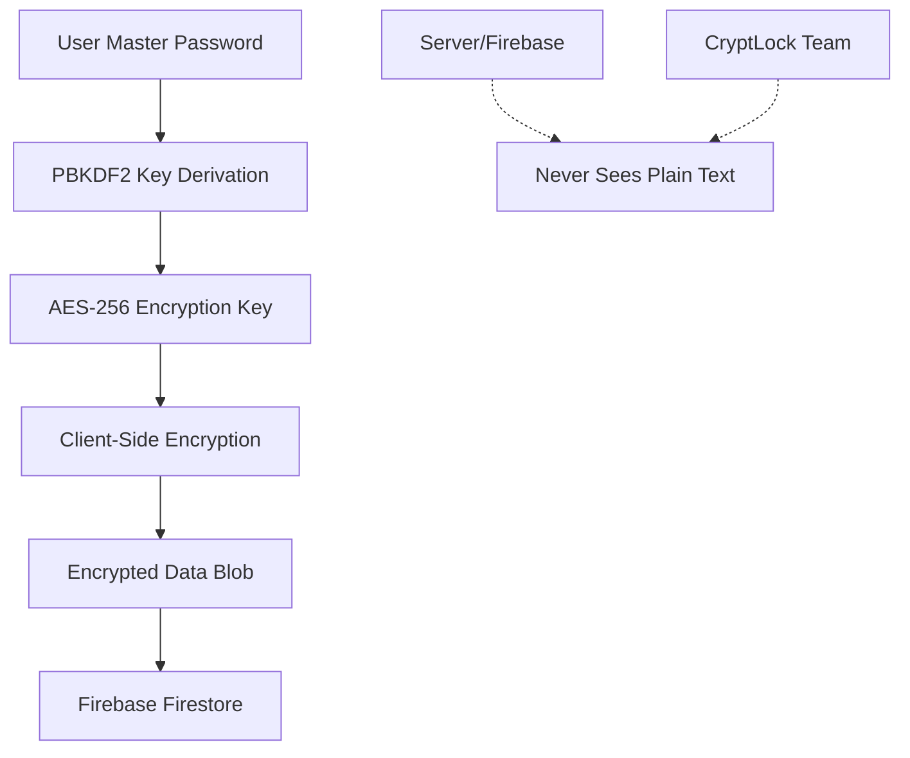

# 🔐 CryptLock - Zero-Knowledge Password Manager

<div align="center">

[](https://nextjs.org/)
[](https://firebase.google.com/)
[](https://www.typescriptlang.org/)
[](https://tailwindcss.com/)
[](https://opensource.org/licenses/MIT)

**A secure, zero-knowledge password manager with end-to-end encryption.**  
*Your master password never leaves your device, ensuring complete privacy and security.*

[🚀 Live Demo](https://cryptlock-chi.vercel.app/) • [🔒 Security](#-security-architecture)

</div>

## 📋 Table of Contents

- [🎯 Problem Statement](#-problem-statement)
- [🔒 Security Architecture](#-security-architecture)
- [📸 Screenshots](#-screenshots)
- [✨ Features](#-features)
- [✨ Browser Extension](#-browser-extension)
- [🚀 Quick Start](#-quick-start)
- [🏗️ Tech Stack](#️-tech-stack)
- [📁 Project Structure](#-project-structure)
- [🤝 Contributing](#-contributing)
- [📄 License](#-license)

---

## 🎯 Problem Statement

### The Challenge
Most people have **100+ online accounts** but reuse only **5-7 passwords**. Traditional password managers store your master password or have recovery mechanisms, meaning they can potentially access your data.

### Why Your Passwords Are Safe from Everyone

CryptLock uses **true zero-knowledge architecture** - we literally cannot see your passwords, even if we wanted to.

#### Dual Authentication System
- **Account Password**: Firebase authentication for app access (recoverable via email)
- **Master Password**: Vault encryption key that **never leaves your device** (unrecoverable by design)

```
┌─────────────────┐    ┌──────────────────┐    ┌─────────────────┐
│   Your Device   │    │   CryptLock      │    │   Your Vault    │
│                 │    │   Servers        │    │                 │
│ Master Password │───▶│                 │───▶│ Encrypted Blob │
│ (Never Sent!)   │    │ Cannot Read This │    │ (Unreadable)    │
│                 │    │                  │    │                 │
│ AES-256 Key     ┼──▶│ Only Stores      ┼─-─▶│ Encrypted Data  │
│ (Local Only)    │    │ Encrypted Data   │    │                 │
└─────────────────┘    └──────────────────┘    └─────────────────┘
```

#### Your Passwords Are Protected From:
- ✅ **Hackers**: Even if CryptLock is breached, your data remains encrypted
- ✅ **Governments**: No backdoors or master keys exist - we cannot be forced to decrypt
- ✅ **CryptLock Employees**: Our team cannot access your passwords
- ✅ **Future Threats**: Quantum-resistant by design
- ⚠️ **Trade-off**: Forgotten master password = permanent data loss (this ensures your security)

## 🔒 Security Architecture

### Zero-Knowledge Design Principles



### Encryption Flow
1. **Master Password** → PBKDF2 (100,000+ iterations) → **AES-256 Key**
2. **Client-Side Encryption** → **Encrypted Blob** → **Firebase Storage**
3. Only your device can decrypt with the original master password

### Technical Implementation
- 🔐 **AES-256-CBC** encryption with unique IVs
- 🔑 **PBKDF2** key derivation (100,000+ iterations) with unique salts
- 🚫 **No plain-text** storage on servers
- 🛡️ **Firestore security rules** prevent unauthorized access
- 🔒 **Master password** never transmitted or stored anywhere

## 📸 Screenshots

<div align="center">

### 🏠 Landing Page

*Zero-knowledge security with beautiful, modern design*

### 📊 Security Dashboard  

*Real-time security insights and vault management*

</div>

## ✨ Features

- 🔑 **Password Generation** - Cryptographically secure password generation with customizable criteria
- 📊 **Security Dashboard** - Real-time password strength evaluation and security insights
- 📝 **Multi-Type Storage** - Store passwords, secure notes, credit cards, and identity information
- 🚨 **Security Monitoring** - Password strength tracking and security recommendations
- 🔄 **Real-Time Sync** - Encrypted data synchronization with optimized performance
- 💾 **Offline Support** - Works without internet connection with local caching
- 📱 **Cross-Platform Ready** - Responsive web app design
- 🛡️ **Route Protection** - Automatic authentication guards and session management

## 🌐 Browser Extension

CryptLock includes a powerful browser extension that automatically detects password fields and saves them to your vault with one click.

### ✨ Extension Features
- 🎯 **Auto-Detection** - Automatically finds password fields on any website
- 💾 **One-Click Save** - Save passwords directly from any website
- 🔒 **Zero-Knowledge** - Passwords go directly to your encrypted vault
- 🌍 **Universal** - Works on Gmail, GitHub, banking sites, and more
- 🚫 **No Local Storage** - Extension never stores passwords locally

### 📦 Installation
1. **Download**: Visit your CryptLock homepage and click "Download Extension"
2. **Extract**: Unzip the downloaded file to a folder
3. **Install**:
   - **Chrome/Edge**: Go to `chrome://extensions/` → Enable Developer mode → Load unpacked
   - **Firefox**: Go to `about:debugging` → Load Temporary Add-on → Select manifest.json
4. **Use**: Visit any website, type in password fields, click "Save to CryptLock"

> 📁 **Extension files are in the `/extension` folder** 

## 🚀 Quick Start

### Prerequisites

- **Node.js** 18+ ([Download](https://nodejs.org/))
- **npm** or **yarn** package manager
- **Firebase account** ([Sign up](https://firebase.google.com/))
- **Git** ([Download](https://git-scm.com/))

### 1. Clone & Install

```bash
# Clone the repository
git clone https://github.com/nerdylua/password-manager-web.git
cd password-manager-web

# Install dependencies
npm install
# or
yarn install
```

### 2. Environment Setup

Create a `.env.local` file in the root directory:

```env
# Firebase Configuration
NEXT_PUBLIC_FIREBASE_API_KEY=your_api_key_here
NEXT_PUBLIC_FIREBASE_AUTH_DOMAIN=your_project.firebaseapp.com
NEXT_PUBLIC_FIREBASE_PROJECT_ID=your_project_id
NEXT_PUBLIC_FIREBASE_STORAGE_BUCKET=your_project.appspot.com
NEXT_PUBLIC_FIREBASE_MESSAGING_SENDER_ID=your_messaging_sender_id
NEXT_PUBLIC_FIREBASE_APP_ID=your_app_id

# Optional: Firebase Emulator (for development)
NEXT_PUBLIC_USE_EMULATOR=false
```

### 3. Run Development Server

```bash
npm run dev
# or
yarn dev
```

🎉 **Success!** Visit [http://localhost:3000](http://localhost:3000) to see CryptLock in action!

## 🏗️ Tech Stack

<table>
<tr>
<td>

**Frontend**
- Next.js 15 (App Router)
- TypeScript
- Tailwind CSS
- shadcn/ui components
- Framer Motion
- Lucide React icons
- React Hook Form

</td>
<td>

**Backend & Services**
- Firebase Authentication
- Cloud Firestore
- Firebase Hosting (optional)

</td>
</tr>
<tr>
<td>

**Security & Crypto**
- CryptoJS (AES-256-CBC)
- PBKDF2 key derivation
- zxcvbn password analysis
- Client-side encryption

</td>
<td>

**Development**
- ESLint + Prettier
- TypeScript strict mode
- next-themes (theme switching)
- Vercel deployment

</td>
</tr>
</table>

## 📁 Project Structure

```
password-manager-web/
├── 📁 app/                     # Next.js App Router pages
│   ├── 📁 auth/               # Authentication pages
│   │   ├── login/             # Login page
│   │   ├── register/          # Registration page
│   │   └── forgot-password/   # Password recovery guidance
│   ├── 📁 dashboard/          # Security dashboard
│   ├── 📁 vault/              # Main vault interface
│   ├── layout.tsx             # Root layout with providers
│   └── page.tsx               # Landing page
├── 📁 components/             # Reusable UI components
│   ├── 📁 ui/                # shadcn/ui base components
│   ├── theme-provider.tsx    # Theme context provider
│   ├── theme-toggle.tsx      # Theme switcher component
│   ├── error-modal.tsx       # Comprehensive error handling
│   └── password-generator.tsx # Password generation UI
├── 📁 contexts/               # React contexts
│   └── AuthContext.tsx       # Authentication & user state
├── 📁 lib/                    # Core utilities & services
│   ├── firebase.ts           # Firebase configuration with optimization
│   ├── encryption.ts         # Zero-knowledge encryption
│   ├── vault-service.ts      # Vault CRUD with real-time sync
│   ├── password-strength.ts  # Security analysis
│   └── utils.ts              # Utility functions
├── 📁 public/                 # Static assets
├── 📄 .env.local.example     # Environment template
├── 📄 .gitignore             # Git ignore rules
├── 📄 LICENSE                # MIT License
└── 📄 README.md              # This file
```

## 🤝 Contributing

We welcome contributions! Please fork the repository and submit a pull request.

## 📄 License

This project is licensed under the **MIT License** - see the [LICENSE](LICENSE) file for details.

---

<div align="center">

**🔑 Remember**: Your master password cannot be recovered due to our zero-knowledge architecture. Keep it safe!

Built with ❤️ using Next.js, Firebase, and cutting-edge cryptography.

</div>
