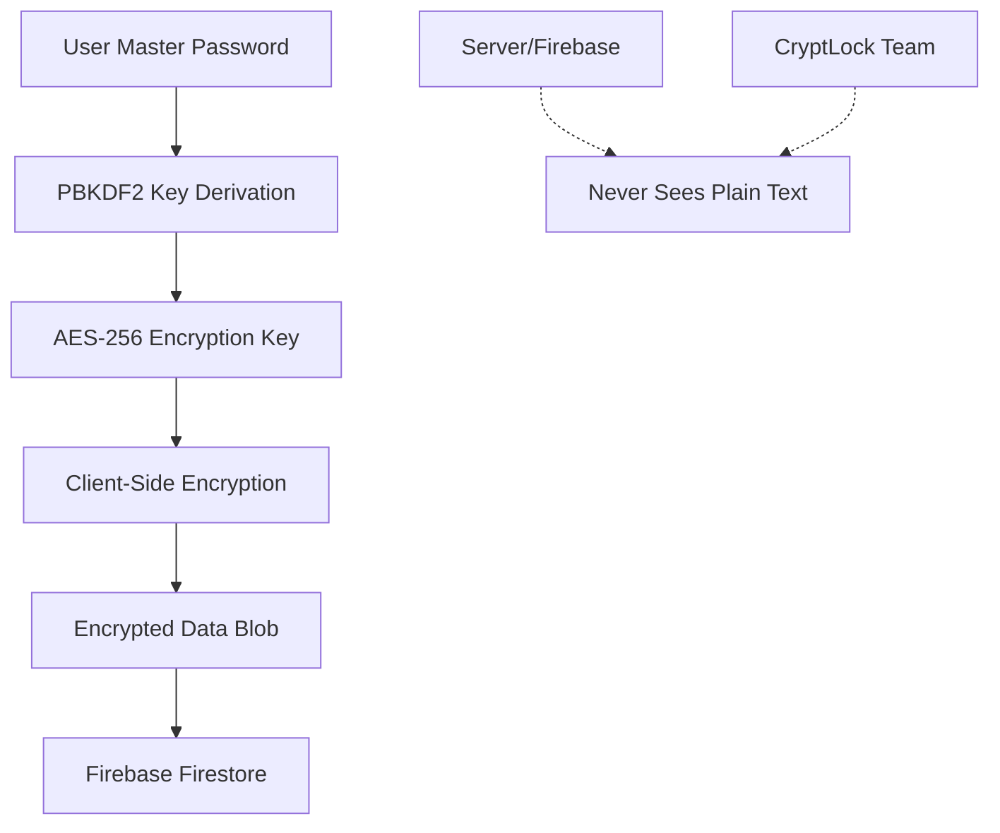

# 🔐 CryptLock - Zero-Knowledge Password Manager

<div align="center">

[](https://nextjs.org/)
[](https://firebase.google.com/)
[](https://www.typescriptlang.org/)
[](https://tailwindcss.com/)
[](https://opensource.org/licenses/MIT)

**A secure, zero-knowledge password manager with end-to-end encryption.**  
*Your master password never leaves your device, ensuring complete privacy and security.*

[🚀 Live Demo](https://cryptlock.vercel.app) • [🔒 Security](#-security-architecture)

</div>

---

## 📋 Table of Contents

- [✨ Features](#-features)
- [🚀 Quick Start](#-quick-start)
- [🏗️ Tech Stack](#️-tech-stack)
- [📁 Project Structure](#-project-structure)
- [🔒 Security Architecture](#-security-architecture)
- [🤝 Contributing](#-contributing)
- [📄 License](#-license)

## ✨ Features

- 🔒 **Zero-Knowledge Architecture** - Your master password never leaves your device
- 🛡️ **Military-Grade Encryption** - AES-256-CBC with PBKDF2 key derivation (100,000+ iterations)
- 📱 **Cross-Platform Ready** - Responsive web app with offline support
- 🔑 **Password Generation** - Cryptographically secure password generation with customizable criteria
- 📊 **Security Dashboard** - Real-time password strength evaluation and security insights
- 🔄 **Real-Time Sync** - Encrypted data synchronization with optimized performance
- 📝 **Multi-Type Storage** - Store passwords, secure notes, credit cards, and identity information
- 🚨 **Security Monitoring** - Password strength tracking and security recommendations
- 💾 **Offline Support** - Works without internet connection with local caching
- 🛡️ **Route Protection** - Automatic authentication guards and session management

## 🚀 Quick Start

### Prerequisites

- **Node.js** 18+ ([Download](https://nodejs.org/))
- **npm** or **yarn** package manager
- **Firebase account** ([Sign up](https://firebase.google.com/))
- **Git** ([Download](https://git-scm.com/))

### 1. Clone & Install

```bash
# Clone the repository
git clone https://github.com/nerdylua/password-manager-web.git
cd password-manager-web

# Install dependencies
npm install
# or
yarn install
```

### 2. Environment Setup

Create a `.env.local` file in the root directory:

```env
# Firebase Configuration
NEXT_PUBLIC_FIREBASE_API_KEY=your_api_key_here
NEXT_PUBLIC_FIREBASE_AUTH_DOMAIN=your_project.firebaseapp.com
NEXT_PUBLIC_FIREBASE_PROJECT_ID=your_project_id
NEXT_PUBLIC_FIREBASE_STORAGE_BUCKET=your_project.appspot.com
NEXT_PUBLIC_FIREBASE_MESSAGING_SENDER_ID=your_messaging_sender_id
NEXT_PUBLIC_FIREBASE_APP_ID=your_app_id

# Optional: Firebase Emulator (for development)
NEXT_PUBLIC_USE_EMULATOR=false
```

### 3. Run Development Server

```bash
npm run dev
# or
yarn dev
```

🎉 **Success!** Visit [http://localhost:3000](http://localhost:3000) to see CryptLock in action!


## 🏗️ Tech Stack

<table>
<tr>
<td>

**Frontend**
- Next.js 15 (App Router)
- TypeScript
- Tailwind CSS
- shadcn/ui components
- Framer Motion
- Lucide React icons
- React Hook Form

</td>
<td>

**Backend & Services**
- Firebase Authentication
- Cloud Firestore
- Firebase Hosting (optional)

</td>
</tr>
<tr>
<td>

**Security & Crypto**
- CryptoJS (AES-256-CBC)
- PBKDF2 key derivation
- zxcvbn password analysis
- Client-side encryption

</td>
<td>

**Development**
- ESLint + Prettier
- TypeScript strict mode
- next-themes (theme switching)
- Vercel deployment

</td>
</tr>
</table>

## 📁 Project Structure

```
password-manager-web/
├── 📁 app/                     # Next.js App Router pages
│   ├── 📁 auth/               # Authentication pages
│   │   ├── login/             # Login page
│   │   ├── register/          # Registration page
│   │   └── forgot-password/   # Password recovery guidance
│   ├── 📁 dashboard/          # Security dashboard
│   ├── 📁 vault/              # Main vault interface
│   ├── layout.tsx             # Root layout with providers
│   └── page.tsx               # Landing page
├── 📁 components/             # Reusable UI components
│   ├── 📁 ui/                # shadcn/ui base components
│   ├── theme-provider.tsx    # Theme context provider
│   ├── theme-toggle.tsx      # Theme switcher component
│   ├── error-modal.tsx       # Comprehensive error handling
│   └── password-generator.tsx # Password generation UI
├── 📁 contexts/               # React contexts
│   └── AuthContext.tsx       # Authentication & user state
├── 📁 lib/                    # Core utilities & services
│   ├── firebase.ts           # Firebase configuration with optimization
│   ├── encryption.ts         # Zero-knowledge encryption
│   ├── vault-service.ts      # Vault CRUD with real-time sync
│   ├── password-strength.ts  # Security analysis
│   └── utils.ts              # Utility functions
├── 📁 public/                 # Static assets
├── 📄 .env.local.example     # Environment template
├── 📄 .gitignore             # Git ignore rules
├── 📄 LICENSE                # MIT License
└── 📄 README.md              # This file
```

## 🔒 Security Architecture

### Zero-Knowledge Design Principles



### Encryption Flow

1. **Master Password Entry**: User enters master password (never transmitted)
2. **Key Derivation**: PBKDF2 with 100,000+ iterations generates encryption key
3. **Data Encryption**: AES-256-CBC encrypts all vault data client-side
4. **Secure Storage**: Only encrypted blobs stored in Firestore
5. **Decryption**: Only user's device can decrypt data with master password

### Security Features

- 🔐 **AES-256-CBC** encryption with unique IVs
- 🔑 **PBKDF2** key derivation (100,000+ iterations)
- 🧂 **Unique salts** for each user
- 🚫 **No plain-text storage** on servers
- 🔒 **Master password** never leaves device
- 🛡️ **Firestore security rules** prevent unauthorized access

## 🤝 Contributing

We welcome contributions! Please fork the repository and submit a pull request.

## 📄 License

This project is licensed under the **MIT License** - see the [LICENSE](LICENSE) file for details.

---

<div align="center">

**🔑 Remember**: Your master password cannot be recovered due to our zero-knowledge architecture. Keep it safe!

Built with ❤️ using Next.js, Firebase, and cutting-edge cryptography.

</div>
